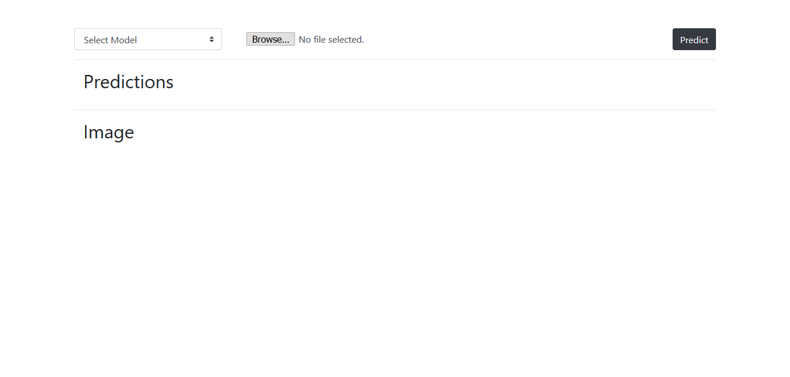
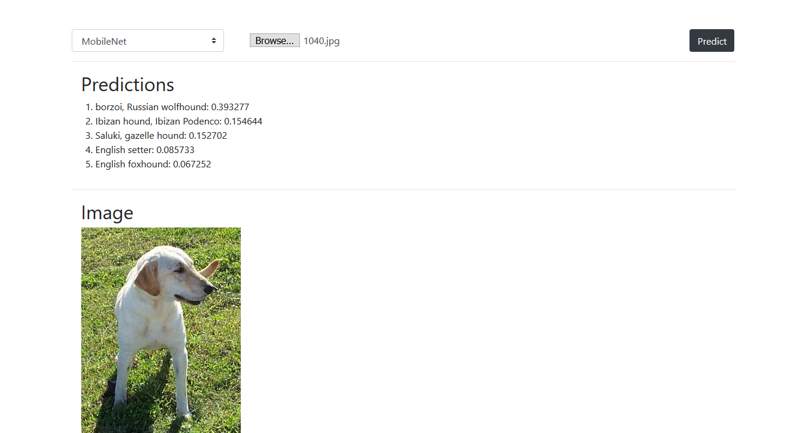
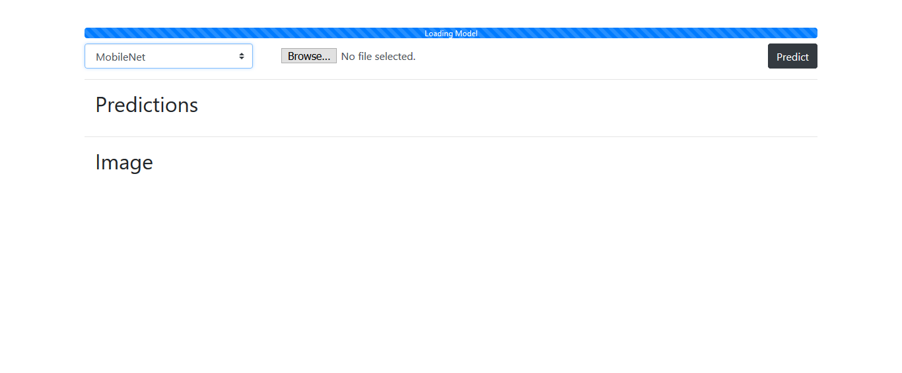

# Image Prediction with client side neural network using Tensorflow.js

TensorFlow.js is a library for developing and training ML models in JavaScript, and deploying in the browser or on Node.js. 

I have created a web application to choose an image and submit it to our model. The models used are MobileNet & VGG16. The app will give us back the top five highest predictions for the image from the imageNet classes. For hosting the web app. I’m using Express. Express is a minimalistic framework very similar to flask but it’s for node.js not for python

## Getting Started

These instructions will get you a copy of the project up and running on your local machine for development and testing purposes.

## Installation

Use the package manager [pip](https://pip.pypa.io/en/stable/) to install tensorflowjs.

```bash
pip install tensorflowjs
```

For hosting the web app. I’m using Express. Express is a minimalistic framework very similar to flask but it’s for node.js not for python

```
install [node.js](https://nodejs.org/en/download/) on your system
```
Then go to the folder containing package.json file (TensorFlowJS/local-server/package.json).
Run the command:- 
```bash
npm install
```
After running the above command, you will have node_modules folder as well as package-lock.json file inside local-server directory.
Now we have node & express setup to be able to serve our models & host our tensorflow apps that we will be developing.

Inside the MobileNet folder (TensorFlowJS\static\tfjs-models\MobileNet), I have uploaded the corresponding weight files and model.json file.
The VGG16 model is too large to host here (over 500 MB).
To generate the needed model.json and weight files for VGG16, follow the below instructions:
1) Method 1:
If you have already saved model.h5 file, use the following command in terminal:
```bash
tensorflowjs_converter --input_format keras path_to_saved_model/model.h5/ output_path/
```
2) Method 2:
Directly using python & Keras
```python
import keras
import tensorflowjs as tfjs

vgg16 = keras.applications.vgg16.VGG16()
tfjs.converters.save_keras_model(vgg16,'../../tfjs-models/VGG16')
```

Remain inside the local-server directory only.
Run the command:-
```bash
node .\server.js
```
If you get the following message:
```bash
serving static on 81
```
then you are good to go
Open your desired browser & go to the follwing link:
```
http://localhost:81/predict-with-tfjs.html
```
You wil see the following page:


Select the desired model:


Choose the desired image & click the predict button:

